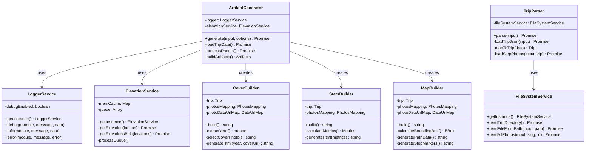

# Refactorisation ES2015 : Guide d'Architecture OOP pour Développeurs Java

**Date de création** : 28 octobre 2025  
**Tâche associée** : task-18  
**Auteur** : GitHub Copilot Agent

---

## 📋 Table des Matières

1. [Vue d'ensemble](#vue-densemble)
2. [Objectifs et Bénéfices](#objectifs-et-bénéfices)
3. [Principes de Conception](#principes-de-conception)
4. [Architecture Cible](#architecture-cible)
5. [Patterns de Refactorisation](#patterns-de-refactorisation)
6. [Plan d'Implémentation](#plan-dimplémentation)
7. [Conventions de Code](#conventions-de-code)
8. [Exemples de Migration](#exemples-de-migration)
9. [Tests Unitaires](#tests-unitaires)
10. [Glossaire Java ↔ TypeScript](#glossaire-java--typescript)

---

## 📖 Vue d'ensemble

### État Actuel du Projet

Le projet Travel Book JS utilise actuellement une **approche fonctionnelle** :
- Services exportés comme **fonctions** (`export function myService()`)
- État global via variables de module
- Pas d'encapsulation claire
- Difficulté pour les développeurs Java à comprendre l'architecture

### État Cible

Adopter une **architecture orientée objet (OOP)** avec :
- **Classes ES2015** avec encapsulation
- **Injection de dépendances** via constructeurs
- **Visibilité explicite** (public/private/protected)
- **Patterns familiers** pour développeurs Java (Singleton, Builder, Factory)

---

## 🎯 Objectifs et Bénéfices

### Pour les Développeurs Java

| Aspect | Bénéfice |
|--------|----------|
| **Structure familière** | Classes, constructeurs, méthodes comme en Java |
| **Encapsulation** | État et comportement regroupés dans des classes |
| **Visibilité** | Mots-clés `public`, `private`, `protected` comme en Java |
| **Injection de dépendances** | Via constructeur (pattern Spring-like) |
| **Testabilité** | Mocking facilité avec des instances de classe |
| **Hiérarchie claire** | Organisation en packages logiques (core, builders, generators) |

### Pour le Projet

- ✅ **Maintenabilité** : Code plus lisible et modulaire
- ✅ **Scalabilité** : Architecture extensible
- ✅ **Onboarding** : Nouveaux développeurs Java intégrés plus rapidement
- ✅ **Documentation** : Structure auto-documentée via classes
- ✅ **Tests** : Meilleure couverture grâce à l'isolation

---

## 🏗️ Principes de Conception

### 1. Une Classe = Une Responsabilité (SRP)

Chaque classe a **une seule raison de changer**.

**Exemple** :
- `LoggerService` : uniquement responsable du logging
- `CoverBuilder` : uniquement responsable de la page de couverture
- `ArtifactGenerator` : orchestre les builders (pas de logique métier détaillée)

### 2. Injection de Dépendances (DI)

Les dépendances sont **injectées via le constructeur**, jamais créées à l'intérieur de la classe.

**Avant (couplage fort)** :
```typescript
function buildCover() {
  const logger = createLogger() // ❌ Création interne
  logger.info('Building cover')
}
```

**Après (injection)** :
```typescript
class CoverBuilder {
  constructor(
    private readonly logger: LoggerService // ✅ Injecté
  ) {}
  
  build(): string {
    this.logger.info('cover', 'Building cover')
  }
}
```

### 3. Singleton pour Services Stateless

Services sans état métier → pattern **Singleton**.

```typescript
export class LoggerService {
  private static instance: LoggerService
  private debugEnabled = false // État de configuration OK
  
  private constructor() {} // ⚠️ Constructeur PRIVÉ
  
  public static getInstance(): LoggerService {
    if (!LoggerService.instance) {
      LoggerService.instance = new LoggerService()
    }
    return LoggerService.instance
  }
}

// Export pour usage externe
export const loggerService = LoggerService.getInstance()
```

### 4. Classes avec État pour Builders

Les builders ont un **état contextuel** → classes instanciables.

```typescript
export class CoverBuilder {
  constructor(
    private readonly trip: Trip,
    private readonly photosMapping: PhotosMapping,
    private readonly photoDataUrlMap: DataUrlMap
  ) {}
  
  public build(): string {
    const year = this.extractYear() // Utilise this.trip
    return this.generateHtml(year)
  }
  
  private extractYear(): number {
    return new Date(this.trip.start_date * 1000).getFullYear()
  }
  
  private generateHtml(year: number): string { /* ... */ }
}
```

### 5. Visibilité Explicite

Toujours spécifier **public** ou **private** (comme en Java).

| TypeScript | Java | Usage |
|------------|------|-------|
| `public method()` | `public void method()` | API exposée |
| `private helper()` | `private void helper()` | Logique interne |
| `protected shared()` | `protected void shared()` | Héritage (rare) |

---

## 🏛️ Architecture Cible

### Structure des Dossiers

```
src/
├── services/
│   ├── core/                      # Services fondamentaux (singletons)
│   │   ├── LoggerService.ts
│   │   ├── ElevationService.ts
│   │   └── FileSystemService.ts
│   ├── builders/                  # Builders HTML (classes avec contexte)
│   │   ├── CoverBuilder.ts
│   │   ├── StatsBuilder.ts
│   │   ├── MapBuilder.ts
│   │   └── StepBuilder.ts
│   ├── generators/                # Orchestrateurs (classes avec DI)
│   │   └── ArtifactGenerator.ts
│   └── parsers/                   # Parsers de données
│       └── TripParser.ts
├── composables/                   # Composables Vue (classes TypeScript)
│   ├── useFileSelection.ts
│   └── useGeneration.ts
├── stores/                        # Pinia stores (utilise DI)
│   └── trip.store.ts
├── models/                        # DTOs et interfaces
│   └── types.ts
└── views/                         # Composants Vue
    ├── HomeView.vue
    ├── GenerationView.vue
    └── ViewerView.vue
```

### Hiérarchie des Classes



---

## 🔄 Patterns de Refactorisation

### Pattern 1 : Service Fonctionnel → Singleton

**Avant** :
```typescript
// logger.service.ts
let debugEnabled = false

export function setDebugEnabled(enabled: boolean) {
  debugEnabled = enabled
}

export function debug(module: string, message: string) {
  if (!debugEnabled) return
  console.log(`[DEBUG][${module}]`, message)
}
```

**Après** :
```typescript
// LoggerService.ts
export class LoggerService {
  private static instance: LoggerService
  private debugEnabled = false
  
  private constructor() {}
  
  public static getInstance(): LoggerService {
    if (!LoggerService.instance) {
      LoggerService.instance = new LoggerService()
    }
    return LoggerService.instance
  }
  
  public setDebugEnabled(enabled: boolean): void {
    this.debugEnabled = enabled
  }
  
  public debug(module: string, message: string, data?: any): void {
    if (!this.debugEnabled) return
    console.log(`[DEBUG][${module}]`, message, data)
  }
}

// Export singleton pour usage
export const loggerService = LoggerService.getInstance()
```

**Migration des imports** :
```typescript
// Avant
import { debug, setDebugEnabled } from './logger.service'
debug('module', 'message')

// Après
import { loggerService } from './core/LoggerService'
loggerService.debug('module', 'message')
```

---

### Pattern 2 : Builder Fonctionnel → Classe avec Contexte

**Avant** :
```typescript
// cover.builder.ts
export type CoverBuilderContext = {
  trip: Trip
  photosMapping: PhotosMapping
  photoDataUrlMap: DataUrlMap
}

export function buildCoverSection(context: CoverBuilderContext): string {
  const { trip, photosMapping, photoDataUrlMap } = context
  const year = new Date(trip.start_date * 1000).getFullYear()
  let coverUrl = selectCoverPhoto(trip, photosMapping)
  return generateHtml(year, coverUrl, photoDataUrlMap)
}

function selectCoverPhoto(trip: Trip, photosMapping: PhotosMapping): string | null {
  // Logique...
}

function generateHtml(year: number, coverUrl: string | null, photoDataUrlMap: DataUrlMap): string {
  // Logique...
}
```

**Après** :
```typescript
// CoverBuilder.ts
import { Trip, PhotosMapping, DataUrlMap } from '../../models/types'
import { loggerService } from '../core/LoggerService'

export class CoverBuilder {
  constructor(
    private readonly trip: Trip,
    private readonly photosMapping: PhotosMapping,
    private readonly photoDataUrlMap: DataUrlMap
  ) {}
  
  public build(): string {
    loggerService.debug('CoverBuilder', 'Building cover section')
    
    const year = this.extractYear()
    const coverUrl = this.selectCoverPhoto()
    
    return this.generateHtml(year, coverUrl)
  }
  
  private extractYear(): number {
    return new Date(this.trip.start_date * 1000).getFullYear()
  }
  
  private selectCoverPhoto(): string | null {
    const rawCover = (this.trip as any).cover_photo?.path || null
    
    if (!rawCover) {
      for (const step of this.trip.steps) {
        const mapping = this.photosMapping[step.id]
        if (mapping && Object.values(mapping).length > 0) {
          return (Object.values(mapping)[0] as any).path
        }
      }
    }
    
    return rawCover
  }
  
  private generateHtml(year: number, coverUrl: string | null): string {
    let bgStyle = ''
    if (coverUrl) {
      const resolved = this.photoDataUrlMap[coverUrl] || coverUrl
      bgStyle = `style="background-image: url('${resolved}');"`
    }
    
    return `
      <div class="break-after cover-page" ${bgStyle}>
        <div class="cover-year">${year}</div>
        <h1 class="cover-title">${this.trip.name}</h1>
      </div>
    `
  }
}
```

**Migration de l'usage** :
```typescript
// Avant
import { buildCoverSection } from './builders/cover.builder'
const html = buildCoverSection({ trip, photosMapping, photoDataUrlMap })

// Après
import { CoverBuilder } from './builders/CoverBuilder'
const builder = new CoverBuilder(trip, photosMapping, photoDataUrlMap)
const html = builder.build()
```

---

### Pattern 3 : Service Métier → Classe Orchestratrice

**Avant** :
```typescript
// generate.service.ts
export async function generateArtifacts(input: FFInput, options?: GenerateOptions): Promise<Artifacts> {
  logger.info('generate', 'Starting')
  
  const { trip, stepPhotos } = (window as any).__parsedTrip
  const photosMapping = await processPhotos(trip, stepPhotos)
  
  const coverHtml = buildCoverSection({ trip, photosMapping, photoDataUrlMap })
  const statsHtml = buildStatsSection({ trip, photosMapping })
  
  return { manifest: { ... } }
}

async function processPhotos(trip: Trip, stepPhotos: StepPhotos) {
  // Logique interne...
}
```

**Après** :
```typescript
// ArtifactGenerator.ts
import { LoggerService, loggerService } from '../core/LoggerService'
import { ElevationService, elevationService } from '../core/ElevationService'
import { CoverBuilder } from '../builders/CoverBuilder'
import { StatsBuilder } from '../builders/StatsBuilder'

export class ArtifactGenerator {
  constructor(
    private readonly logger: LoggerService,
    private readonly elevationService: ElevationService
  ) {}
  
  public async generate(input: FFInput, options?: GenerateOptions): Promise<Artifacts> {
    this.logger.info('ArtifactGenerator', 'Starting generation')
    
    const { trip, stepPhotos } = await this.loadTripData()
    const { photosMapping, photoDataUrlMap } = await this.processPhotos(trip, stepPhotos)
    
    // Utilisation des builders
    const coverBuilder = new CoverBuilder(trip, photosMapping, photoDataUrlMap)
    const coverHtml = coverBuilder.build()
    
    const statsBuilder = new StatsBuilder(trip, photosMapping)
    const statsHtml = statsBuilder.build()
    
    return this.buildArtifacts(coverHtml, statsHtml, /* ... */)
  }
  
  private async loadTripData(): Promise<TripData> {
    const { trip, stepPhotos } = (window as any).__parsedTrip
    if (!trip) throw new Error('Trip non parsé')
    return { trip, stepPhotos }
  }
  
  private async processPhotos(trip: Trip, stepPhotos: StepPhotos): Promise<PhotoData> {
    // Logique de traitement...
    return { photosMapping, photoDataUrlMap }
  }
  
  private buildArtifacts(...args: any[]): Artifacts {
    return { manifest: { /* ... */ } }
  }
}

// Export singleton
export const artifactGenerator = new ArtifactGenerator(
  loggerService,
  elevationService
)

// ⚠️ Export fonction wrapper pour rétrocompatibilité (temporaire)
export async function generateArtifacts(input: FFInput, options?: GenerateOptions) {
  return artifactGenerator.generate(input, options)
}
```

---

### Pattern 4 : Composant Vue → Composable en Classe

**Avant** :
```vue
<!-- HomeView.vue -->
<script setup lang="ts">
import { ref, computed } from 'vue'
import { useTripStore } from '../stores/trip.store'

const store = useTripStore()
const fileInput = ref<HTMLInputElement | null>(null)
const ready = computed(() => store.hasInput)

function pickDirectory() {
  if ('showDirectoryPicker' in window) {
    store.pickDirectory()
  } else {
    fileInput.value?.click()
  }
}

function onFilesPicked(e: Event) {
  const input = e.target as HTMLInputElement
  if (input.files) store.setFiles(input.files)
}
</script>
```

**Après (avec composable classe)** :
```typescript
// composables/useFileSelection.ts
import { ref, computed, Ref, ComputedRef } from 'vue'
import { useTripStore } from '../stores/trip.store'

export class FileSelectionController {
  private store = useTripStore()
  private fileInputRef = ref<HTMLInputElement | null>(null)
  
  public readonly ready: ComputedRef<boolean>
  public readonly fileInput: Ref<HTMLInputElement | null>
  
  constructor() {
    this.fileInput = this.fileInputRef
    this.ready = computed(() => this.store.hasInput)
  }
  
  public pickDirectory(): void {
    if ('showDirectoryPicker' in window) {
      this.store.pickDirectory()
    } else {
      this.fileInputRef.value?.click()
    }
  }
  
  public onFilesPicked(e: Event): void {
    const input = e.target as HTMLInputElement
    if (input.files) {
      this.store.setFiles(input.files)
    }
  }
  
  public onDrop(e: DragEvent): void {
    const items = e.dataTransfer?.items
    if (!items) return
    this.store.handleDropItems(items)
  }
}

// Composable factory
export function useFileSelection(): FileSelectionController {
  return new FileSelectionController()
}
```

```vue
<!-- HomeView.vue -->
<script setup lang="ts">
import { useFileSelection } from '../composables/useFileSelection'
import { useTripStore } from '../stores/trip.store'

const fileSelection = useFileSelection()
const store = useTripStore()
</script>

<template>
  <main class="container">
    <button @click="fileSelection.pickDirectory()" class="btn">
      Sélectionner un dossier
    </button>
    
    <input 
      ref="fileSelection.fileInput" 
      type="file" 
      webkitdirectory 
      multiple 
      hidden 
      @change="fileSelection.onFilesPicked" 
    />
    
    <div class="dropzone" @dragover.prevent @drop.prevent="fileSelection.onDrop">
      Déposez un dossier ici
    </div>
    
    <button :disabled="!fileSelection.ready" class="btn primary" @click="store.startGeneration">
      Générer
    </button>
  </main>
</template>
```

---

## 📅 Plan d'Implémentation

### Ordre de Refactorisation (par dépendances)

```
Phase 1: Services Core (aucune dépendance)
  ├─ task-18.1: LoggerService
  ├─ task-18.3: FileSystemService
  └─ task-18.2: ElevationService (dépend de Logger)

Phase 2: Builders (dépendent de Logger)
  ├─ task-18.4: CoverBuilder
  ├─ task-18.5: StatsBuilder
  ├─ task-18.6: MapBuilder
  └─ task-18.7: StepBuilder

Phase 3: Services Métier (orchestrent builders)
  ├─ task-18.8: TripParser (dépend de FileSystemService)
  └─ task-18.9: ArtifactGenerator (dépend de tous les builders)

Phase 4: Couche Vue
  ├─ task-18.10: Composables Vue (useFileSelection, useGeneration)
  └─ task-18.11: TripStore (utilise services métier)

Phase 5: Tests et Documentation
  ├─ task-18.12: Tests unitaires
  ├─ task-18.13: Documentation migration
  └─ task-18.14: README et instructions Copilot
```

### Checklist par Service

Pour chaque service à refactoriser :

- [ ] **Analyser** : Identifier état, dépendances, API publique
- [ ] **Créer classe** : Constructeur, propriétés, méthodes
- [ ] **Visibilité** : Marquer public/private selon usage
- [ ] **Singleton ou Instance** : Selon état/contexte
- [ ] **Injecter dépendances** : Via constructeur
- [ ] **Migrer imports** : Dans tous les fichiers clients
- [ ] **Adapter tests** : Mocker dépendances, tester instances
- [ ] **Valider** : `npm run test && npm run dev`
- [ ] **Documenter** : JSDoc sur méthodes publiques

---

## 📐 Conventions de Code

### Nommage des Classes

| Type | Convention | Exemple |
|------|------------|---------|
| Service Core | `*Service` | `LoggerService`, `ElevationService` |
| Builder | `*Builder` | `CoverBuilder`, `MapBuilder` |
| Parser | `*Parser` | `TripParser` |
| Generator | `*Generator` | `ArtifactGenerator` |
| Controller | `*Controller` | `ViewerController` |
| Composable | `use*` (fonction) | `useFileSelection()` |

### Nommage des Instances Singleton

```typescript
// Classe
export class LoggerService { /* ... */ }

// Instance singleton (camelCase, même nom que classe)
export const loggerService = LoggerService.getInstance()
```

### Nommage des Méthodes

| Préfixe | Usage | Exemple |
|---------|-------|---------|
| `get*` | Accesseur | `getElevation()`, `getInstance()` |
| `set*` | Mutateur | `setDebugEnabled()` |
| `build*` | Construction HTML/objet | `build()`, `buildArtifacts()` |
| `generate*` | Génération complexe | `generate()`, `generatePathData()` |
| `calculate*` | Calculs | `calculateBoundingBox()` |
| `load*` | Chargement données | `loadTripData()` |
| `process*` | Traitement | `processPhotos()` |
| `parse*` | Parsing | `parse()` |

### Structure de Fichier

```typescript
// 1. Imports externes
import { Trip, Step } from '../../models/types'

// 2. Imports internes (services)
import { LoggerService, loggerService } from '../core/LoggerService'

// 3. Types et interfaces locaux
export interface BuilderContext {
  trip: Trip
  photosMapping: PhotosMapping
}

// 4. Classe principale
export class MyBuilder {
  // 4.1 Propriétés statiques
  private static instance: MyBuilder
  
  // 4.2 Propriétés d'instance
  private readonly trip: Trip
  
  // 4.3 Constructeur
  constructor(trip: Trip) {
    this.trip = trip
  }
  
  // 4.4 Méthodes statiques
  public static getInstance(): MyBuilder { /* ... */ }
  
  // 4.5 Méthodes publiques
  public build(): string { /* ... */ }
  
  // 4.6 Méthodes privées
  private helper(): void { /* ... */ }
}

// 5. Exports singletons
export const myBuilder = new MyBuilder(/* deps */)

// 6. Fonctions utilitaires (si non liées à la classe)
function standaloneHelper() { /* ... */ }
```

---

## 🧪 Tests Unitaires

### Pattern de Test pour Classes

**Avant (test de fonction)** :
```typescript
// generate.service.spec.ts
import { generateArtifacts } from '../src/services/generate.service'

describe('generate.service', () => {
  it('should generate artifacts', async () => {
    const artifacts = await generateArtifacts(mockInput)
    expect(artifacts).toBeDefined()
  })
})
```

**Après (test de classe)** :
```typescript
// ArtifactGenerator.spec.ts
import { ArtifactGenerator } from '../src/services/generators/ArtifactGenerator'
import { LoggerService } from '../src/services/core/LoggerService'
import { ElevationService } from '../src/services/core/ElevationService'

describe('ArtifactGenerator', () => {
  let generator: ArtifactGenerator
  let mockLogger: LoggerService
  let mockElevation: ElevationService
  
  beforeEach(() => {
    // Créer des mocks
    mockLogger = {
      info: vi.fn(),
      debug: vi.fn(),
      error: vi.fn()
    } as any
    
    mockElevation = {
      getElevationsBulk: vi.fn().mockResolvedValue([100, 200])
    } as any
    
    // Instancier avec dépendances mockées
    generator = new ArtifactGenerator(mockLogger, mockElevation)
  })
  
  it('should log info when starting generation', async () => {
    await generator.generate(mockInput)
    
    expect(mockLogger.info).toHaveBeenCalledWith(
      'ArtifactGenerator', 
      expect.stringContaining('Starting')
    )
  })
  
  it('should fetch elevations in bulk', async () => {
    await generator.generate(mockInput)
    
    expect(mockElevation.getElevationsBulk).toHaveBeenCalled()
  })
})
```

### Builders de Mocks Réutilisables

```typescript
// tests/builders/trip.builder.ts
export class TripBuilder {
  private trip: Partial<Trip> = {
    id: 1,
    name: 'Test Trip',
    start_date: Date.UTC(2023, 0, 1) / 1000,
    steps: []
  }
  
  public withName(name: string): TripBuilder {
    this.trip.name = name
    return this
  }
  
  public withSteps(steps: Step[]): TripBuilder {
    this.trip.steps = steps
    return this
  }
  
  public build(): Trip {
    return this.trip as Trip
  }
}

// Usage
const trip = new TripBuilder()
  .withName('Voyage Slovénie')
  .withSteps([mockStep1, mockStep2])
  .build()
```

---

## 📚 Glossaire Java ↔ TypeScript

| Concept Java | Équivalent TypeScript | Notes |
|--------------|----------------------|-------|
| `public class MyService` | `export class MyService` | Classe exportée |
| `private MyService()` | `private constructor()` | Constructeur privé (singleton) |
| `public static MyService getInstance()` | `public static getInstance(): MyService` | Factory statique |
| `private String field` | `private field: string` | Propriété privée |
| `private final String field` | `private readonly field: string` | Propriété immuable |
| `void method()` | `method(): void` | Méthode sans retour |
| `String method()` | `method(): string` | Méthode avec retour |
| `@Inject` (Spring) | `constructor(dep: Service)` | Injection constructeur |
| `@Service` | `export const service = new Service()` | Singleton exporté |
| `interface MyInterface` | `interface MyInterface` | Interface (identique!) |
| `implements MyInterface` | `implements MyInterface` | Implémentation |
| `extends MyClass` | `extends MyClass` | Héritage |
| `@Override` | Pas de mot-clé (implicite) | Override automatique |
| `Optional<String>` | `string \| null` | Valeur nullable |
| `List<String>` | `Array<string>` ou `string[]` | Liste typée |
| `Map<K, V>` | `Map<K, V>` ou `Record<K, V>` | Map/dictionnaire |
| `throw new Exception()` | `throw new Error()` | Exceptions |
| `try/catch/finally` | `try/catch/finally` | Identique |

---

## ✅ Validation Finale

### Critères de Succès

- [ ] **Tous les services** refactorisés en classes
- [ ] **Tous les builders** utilisent injection de dépendances
- [ ] **Tous les tests** passent avec couverture > 80%
- [ ] **`npm run dev`** fonctionne sans erreur
- [ ] **`npm run build`** génère un build valide
- [ ] **Documentation** à jour (README, instructions Copilot)
- [ ] **Guide migration** créé pour nouveaux développeurs

### Commandes de Validation

```bash
# Tests unitaires
npm run test

# Linting TypeScript
npm run lint

# Build de production
npm run build

# Serveur dev
npm run dev
```

---

## 📖 Ressources Complémentaires

- [TypeScript Handbook - Classes](https://www.typescriptlang.org/docs/handbook/2/classes.html)
- [Vue 3 Composition API](https://vuejs.org/guide/extras/composition-api-faq.html)
- [Dependency Injection in TypeScript](https://dev.to/gistia/dependency-injection-in-typescript-2j7j)
- [Design Patterns in TypeScript](https://refactoring.guru/design-patterns/typescript)

---

**Document vivant** : Ce guide sera mis à jour au fur et à mesure de la refactorisation.
