# Diagrammes UML - Architecture ES2015/OOP

**Date**: 28 octobre 2025  
**Format**: Mermaid (compatible GitHub, VS Code, documentation)

---

## 📋 Table des Matières

1. [Vue d'ensemble de l'architecture](#vue-densemble-de-larchitecture)
2. [Services Core (Singletons)](#services-core-singletons)
3. [Builders](#builders)
4. [Orchestrateurs](#orchestrateurs)
5. [Couche Vue (Composables & Controllers)](#couche-vue-composables--controllers)
6. [Diagramme de séquence : Génération complète](#diagramme-de-séquence--génération-complète)

---

## 🏛️ Vue d'ensemble de l'architecture

### Diagramme de composants

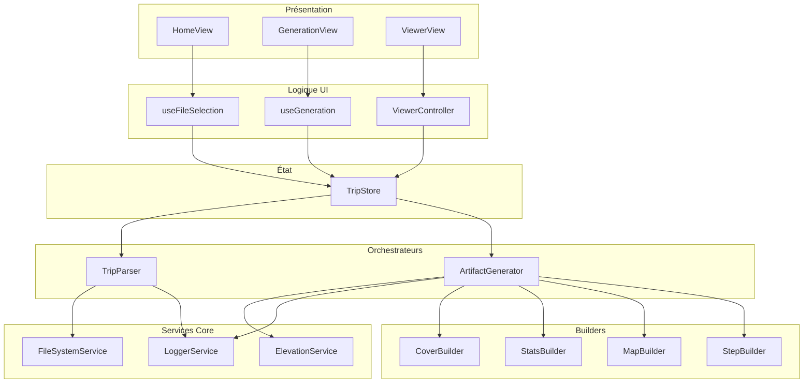

---

## 🔧 Services Core (Singletons)

### LoggerService

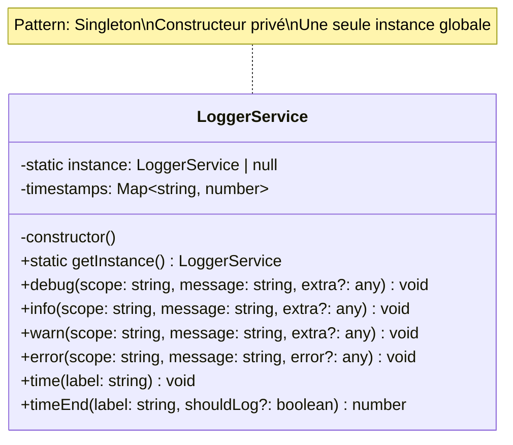

### ElevationService

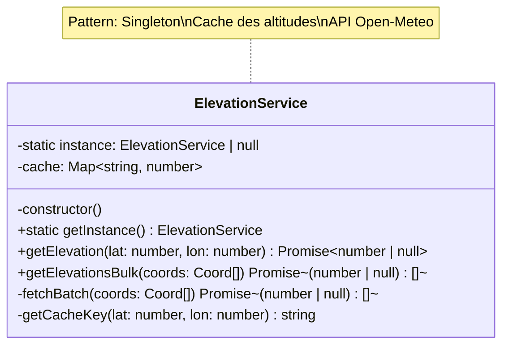

### FileSystemService

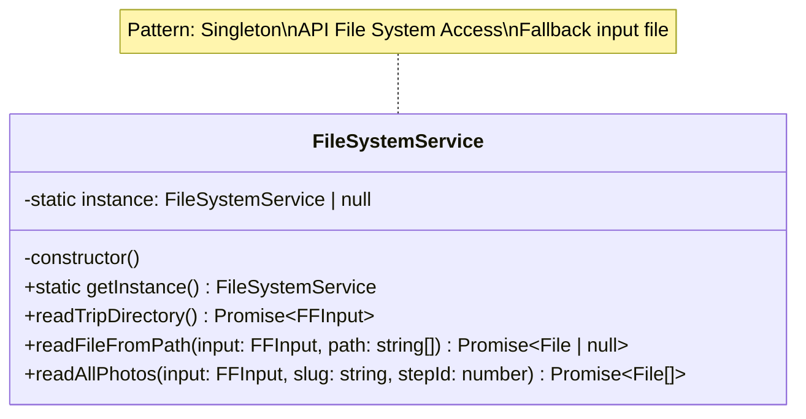

---

## 🏗️ Builders

### Diagramme de classe des Builders

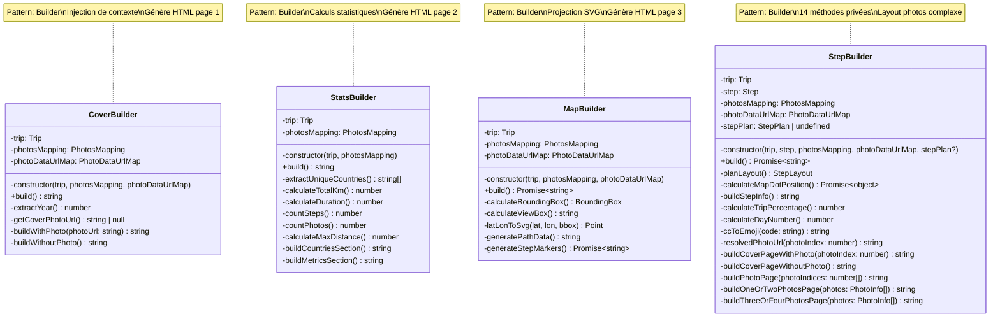

---

## 🎯 Orchestrateurs

### TripParser

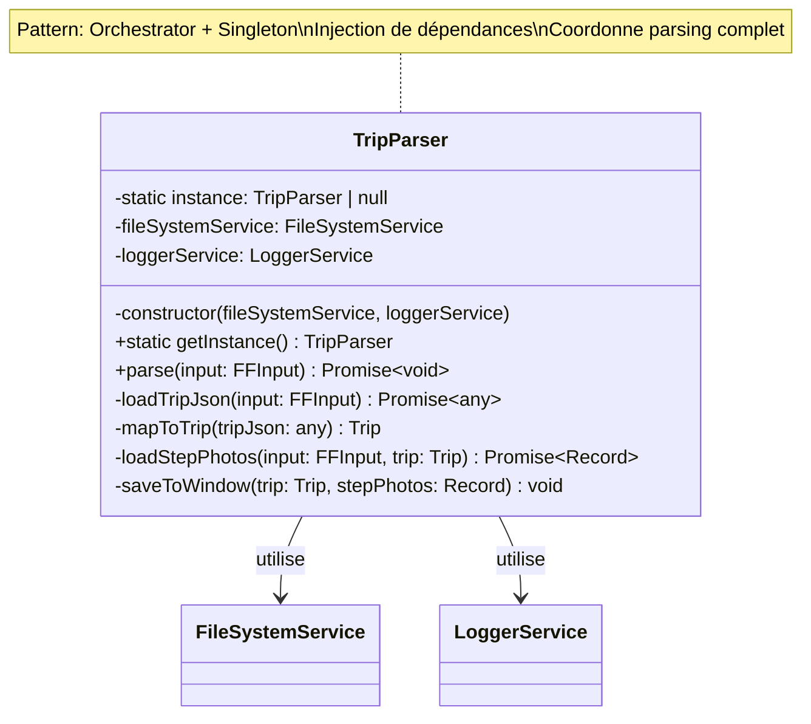

### ArtifactGenerator

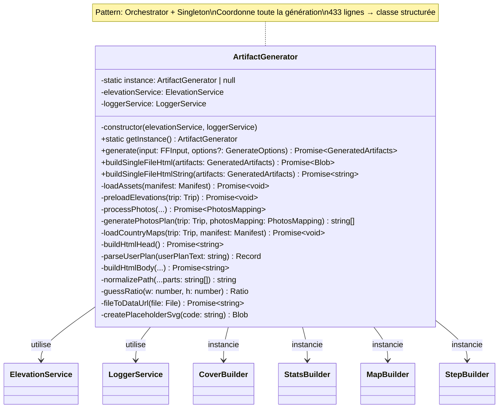

---

## 🎨 Couche Vue (Composables & Controllers)

### Composables

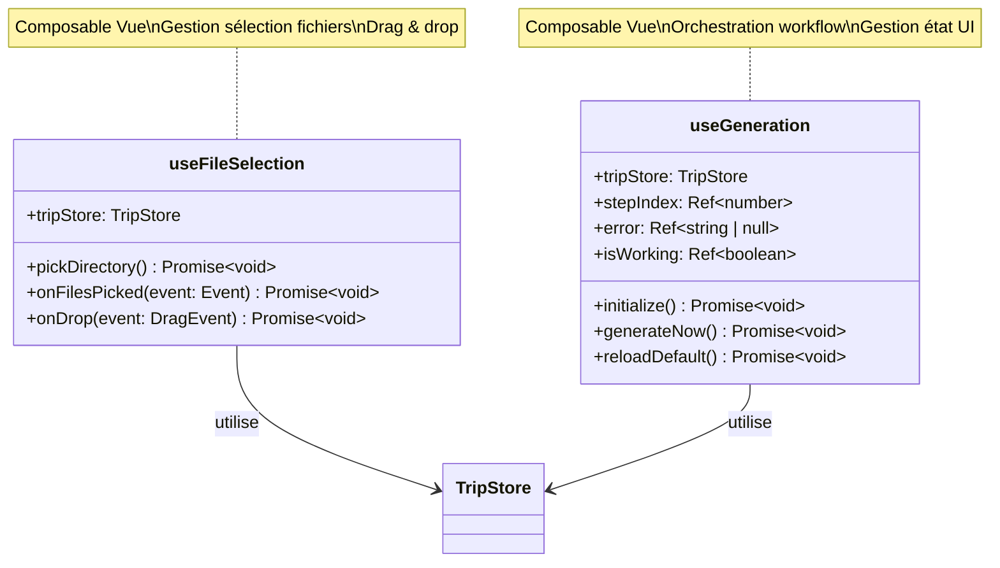

### ViewerController

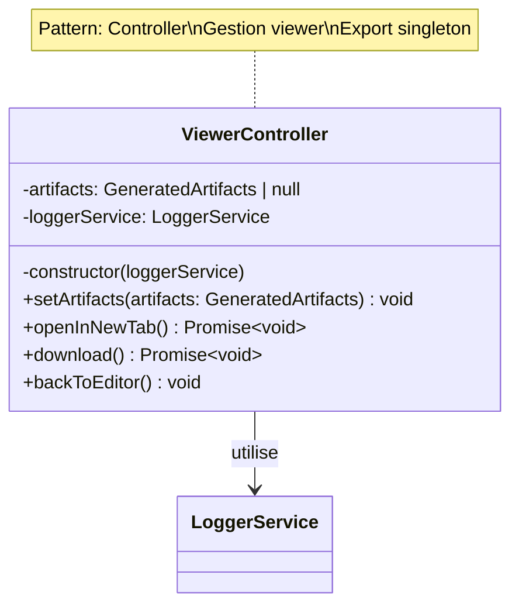

---

## 🔄 Diagramme de séquence : Génération complète

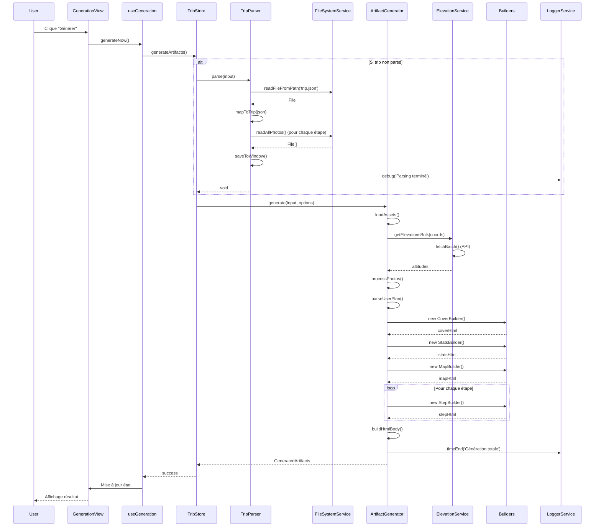

---

## 📊 Diagramme d'injection de dépendances

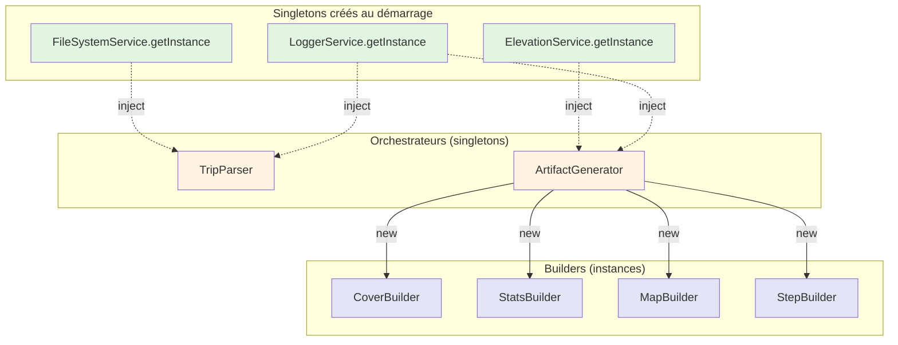

**Légende** :
- 🟢 Vert : Services Singleton (instance unique)
- 🟡 Jaune : Orchestrateurs Singleton avec DI
- 🔵 Bleu : Builders (nouvelles instances à chaque génération)

---

## 📐 Diagramme de classes : Relations complètes

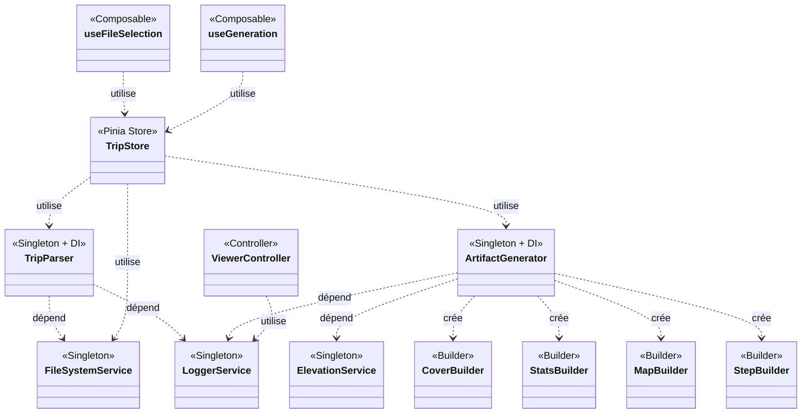

---

## 💡 Notes sur les diagrammes

### Comment lire les diagrammes

1. **Flèches pleines** (`-->`) : Composition/Utilisation directe
2. **Flèches pointillées** (`..>`) : Dépendance/Injection
3. **`-` (private)** : Membres privés
4. **`+` (public)** : Membres publics

### Patterns visualisés

- **Singleton** : `getInstance()` + constructeur privé
- **Builder** : Injection contexte via constructeur, méthode `build()`
- **Orchestrator** : Coordination de multiples services
- **Composable** : Logique réutilisable Vue
- **Controller** : Gestion logique UI complexe

### Rendu des diagrammes

Ces diagrammes Mermaid sont compatibles avec :
- ✅ GitHub (rendu automatique)
- ✅ VS Code (extension Mermaid Preview)
- ✅ Documentation générée (MkDocs, Docusaurus, etc.)
- ✅ Outils de visualisation Mermaid en ligne

---

**Fin du document**
