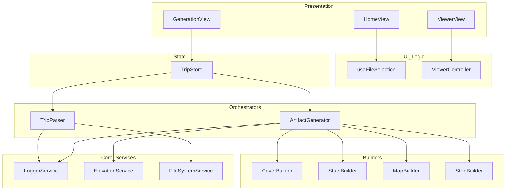
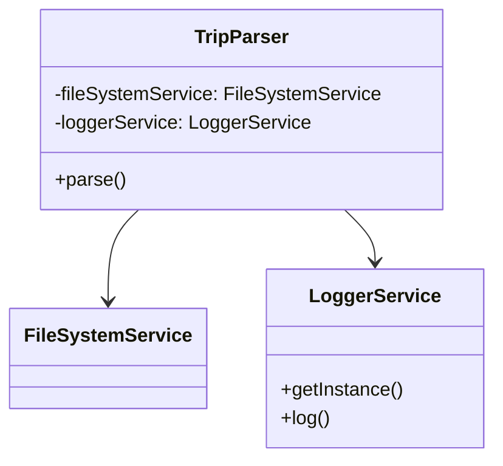

# Architecture Documentation - Components & Dependency Injection

This document provides a clear architecture overview with diagrams. All diagrams use Mermaid notation and are intended to be rendered by supported viewers (GitHub, Mermaid Live, VS Code Mermaid preview).

## High-level component diagram

## Class-level DI example (Mermaid class diagram)

## Illustrative screenshots

The following screenshots demonstrate the live application UI and are useful when discussing where components map to the UI:

## Detailed notes

- The architecture follows an OOP-style decomposition using ES2015 classes.
- Singleton pattern is used for core services; orchestrators are singletons that inject these services; builders are created per-generation.
- Dependency injection is manual via constructor parameters — there is no IoC container.

## Migration guidance and references

- Refer to the ADRs in `backlog/decisions/` for decisions that influenced this architecture.

---

_Last updated: 2025-11-11_
